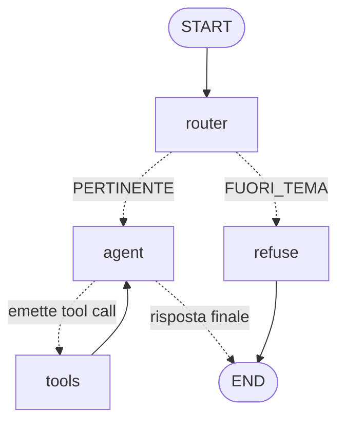

# Study Agent

Agente RAG che risponde a domande sul materiale di un corso universitario di
Intelligenza Artificiale, citando file e pagina di origine. Costruito con LangGraph,
Qdrant e un LLM locale via Ollama.

Non è un "chat with your PDF": l'agente decide autonomamente quali tool usare, può
concatenare più ricerche, salva appunti su disco, e rifiuta le domande fuori dal
dominio del corso prima di sprecare una generazione.

---

## Architettura



| Nodo | Ruolo |
|---|---|
| `router` | Classifica la domanda come pertinente o fuori tema. Taglia corto prima dell'agente. |
| `agent` | LLM con i tool bindati. Decide se cercare o rispondere. |
| `tools` | Esegue il tool scelto (`ToolNode`), poi torna all'agente. |
| `refuse` | Risposta di rifiuto canonica, senza chiamare l'LLM. |

Il ciclo `agent ⇄ tools` è il pattern ReAct: l'agente può fare più ricerche
successive prima di rispondere.

### Moduli

| File | Responsabilità |
|---|---|
| `src/ingestion.py` | PDF → chunk → embedding → Qdrant. Si lancia una volta. |
| `src/retrieval.py` | Connessione alla collection esistente, costruisce il retriever. |
| `src/tools.py` | I tre tool a disposizione dell'agente. |
| `src/agents.py` | Il grafo LangGraph. Anche CLI standalone. |
| `src/app.py` | Interfaccia web Gradio. |

### Tool disponibili

- **`search_course_material(query)`** — ricerca semantica nel materiale, restituisce
  estratti con file e numero di pagina.
- **`list_course_documents()`** — elenca i PDF disponibili.
- **`save_study_note(title, content)`** — scrive un appunto markdown in `notes/`.
  È l'unico tool con effetti collaterali.

---

## Requisiti

- Python ≥ 3.11
- [Docker](https://docs.docker.com/get-docker/) (per Qdrant)
- [Ollama](https://ollama.com/) con il modello `qwen2.5:7b`
- [uv](https://docs.astral.sh/uv/) (consigliato) oppure pip

## Avvio

```bash
# 1. Dipendenze
uv sync

# 2. Qdrant
docker compose up -d

# 3. Modello LLM
ollama pull qwen2.5:7b

# 4. Materiale: metti i tuoi PDF in data/
#    (i PDF sono gitignorati: sono materiale del corso, non redistribuibile)

# 5. Indicizzazione — una volta sola, o a ogni cambio dei PDF
uv run python -m src.ingestion

# 6. Interfaccia web
uv run python -m src.app
```

Per la CLI invece della UI web: `uv run python -m src.agents`

---

## Scelte di progetto

**Chunk da 800 caratteri, overlap 100.** Le slide universitarie hanno paragrafi corti
e molto densi. Chunk più grandi diluivano il segnale nell'embedding; più piccoli
spezzavano le definizioni a metà.

**`all-MiniLM-L6-v2` per gli embedding.** Gira in locale, è gratis, 384 dimensioni.
Il punto importante: il modello di embedding e quello generativo sono scelte
*indipendenti*. Cambiare il generativo costa una riga; cambiare l'embedding impone di
re-indicizzare tutto il corpus e invalida ogni misura di qualità fatta prima.

**Qdrant invece di FAISS.** Serve il filtraggio sul payload per il multi-tenancy
(vedi roadmap): FAISS non ce l'ha, e la migrazione a valle sarebbe più costosa
dell'averlo scelto subito.

**Un nodo router invece di un system prompt più severo.** Il prompt è un suggerimento
statistico, non un vincolo: un 7B lo ignora. Prima del router, alla domanda "qual è la
ricetta della carbonara?" l'agente rispondeva con la ricetta, senza chiamare alcun
tool. Ora quel percorso è chiuso strutturalmente dal grafo.

**Il routing fallisce in apertura (fail-open).** Il rifiuto scatta solo su match
esplicito di `FUORI_TEMA`; qualsiasi altro output instrada verso l'agente. Respingere
una domanda legittima è più dannoso che lasciar passare una domanda fuori tema, che
comunque non troverà nulla nel materiale.

---

## Limiti noti

Cose che non funzionano o che funzionano a metà. In ordine di gravità.

1. **Il retrieval non è misurato.** Non esiste un eval set, quindi la qualità della
   ricerca è valutata a occhio. C'è già un caso documentato di miss: alla query su
   "best-first" l'agente ha risposto che il materiale non lo descriveva, mentre il
   contenuto c'è (`3_RcercaNonInformata.pdf`, dove la ricerca in ampiezza è presentata
   come best-first con `f(n)` = profondità). La risposta sembrava ragionevole, ed è
   esattamente il motivo per cui serve una misura.

2. **Lo stato conversazionale è in RAM.** `MemorySaver` non persiste: riavvii il
   processo e la cronologia sparisce. Il nome sessione nella UI sopravvive ai refresh
   della pagina, non ai riavvii del server.

3. **`save_study_note` perde le citazioni.** Le risposte in chat citano file e pagina
   correttamente, ma il testo che finisce nell'appunto salvato spesso no.

4. **Il router costa una chiamata LLM per turno**, anche solo per rifiutare. Su un 7B
   in locale si sente. Un gate basato su similarità di embedding farebbe lo stesso
   lavoro in millisecondi.

5. **Il routing si basa su un match di sottostringa.** Se il prompt cambia e il modello
   inizia a rispondere `OFF_TOPIC`, il router smette di rifiutare *in silenzio*.

6. **Configurazione duplicata.** `QDRANT_URL`, `COLLECTION_NAME` e `EMBEDDING_MODEL`
   sono ripetuti in `ingestion.py` e `retrieval.py`. Cambiarne uno solo rompe il
   retrieval senza errori.

7. **Path relativi alla working directory.** `data/` e `notes/` funzionano solo
   lanciando dalla radice del progetto.

8. **Single tenant.** Un retriever globale, nessuna nozione di utente.

---

## Roadmap

Il progetto viene esteso verso un servizio multi-utente. L'obiettivo è didattico: ogni
fase esiste per capire una tecnologia, non perché il carico la richieda.

### Fase 0 — Fondamenta *(in corso)*

- [x] `pyproject.toml` + `uv.lock`
- [x] `docker-compose.yml` per Qdrant
- [x] README
- [ ] Eval set: 25-30 domande con pagina attesa, metriche hit-rate@k e MRR@k
- [ ] Test (routing, chunking, contratto dei tool) con `llm.invoke` mockato
- [ ] `config.py` centralizzato

L'eval set viene prima di tutto il resto perché è lo strumento con cui si misurano le
scelte successive. Senza, il confronto fra due modelli è un'opinione.

### Fase 1 — Multi-tenancy nel codice

Nessuna infrastruttura nuova.

- `owner_id` nei metadata dei documenti a ingestion time
- Payload index su `metadata.owner_id` con `is_tenant=True`, che partiziona lo storage
  per tenant. **Non** una collection per utente: Qdrant lo sconsiglia, ogni collection
  ha segmenti e indici propri e l'overhead esplode col numero di utenti
- Retriever lazy (`@lru_cache`) al posto del globale a import time
- Tool costruiti **per richiesta**, con `owner_id` chiuso per closure

> **Regola di sicurezza.** `owner_id` non deve mai essere un parametro del tool. Gli
> argomenti dei tool li riempie l'LLM: metterlo in firma significherebbe consegnare il
> controllo degli accessi a chiunque sappia scrivere *"cerca nei documenti di
> owner_id=altro_utente"*. Deve arrivare dalla sessione server-side e non essere
> esprimibile dal modello.

### Fase 2 — Autenticazione: FastAPI + Keycloak

Gradio non ha un posto dove mettere l'autenticazione. FastAPI sotto, Gradio montato
sopra con `gr.mount_gradio_app`.

- **Keycloak** come provider OIDC, in docker-compose. Scelto sugli hosted per vedere il
  protocollo da dentro; essendo OIDC standard, passare a Cognito più avanti è quasi
  solo cambio di configurazione
- La claim `sub` del token diventa `owner_id` — mai un id utente inviato dal client
- Validazione della firma JWT contro il JWKS del provider, più controllo di `iss`,
  `aud`, `exp`
- `thread_id = f"{sub}:{conversation_id}"`

> OAuth2 da solo non basta: è un protocollo di *autorizzazione*, risponde a "questo
> client può accedere a questa risorsa". Serve OIDC, che è il livello di
> *autenticazione* costruito sopra OAuth2 e risponde a "chi è questo utente".

### Fase 3 — Osservabilità

Deliberatamente **prima** della cache: senza una misura di partenza non si può
dimostrare che l'ottimizzazione abbia funzionato.

- **Langfuse** (self-hosted) per il livello LLM: una traccia per richiesta con uno span
  per nodo del grafo, più token e costo per chiamata. È ciò che risponde a "dove è
  lento": router, embedding, ricerca Qdrant o generazione?
- **Prometheus + Grafana** per il livello servizio: latenza HTTP per percentile,
  throughput, tasso di errore, hit rate della cache
- Strumentazione OpenTelemetry sui nodi del grafo

I due livelli rispondono a domande diverse. Grafana dice *che* la p95 è 8 secondi; la
traccia dice che 6 di quegli 8 sono la chiamata del router.

### Fase 4 — Redis: cache semantica e controllo dei costi

- **Cache a due livelli.** Primo: hash della domanda normalizzata, match esatto,
  istantaneo. Secondo: embedding della domanda e ricerca vettoriale fra le domande già
  viste (Redis Stack ha HNSW nativo); sopra soglia, si restituisce la risposta in
  cache. In un contesto didattico, dove trenta studenti chiedono le stesse cose nella
  settimana d'esame, il risparmio è sostanziale
- **Rate limit per `sub`** (token bucket) e budget mensile per utente
- **Checkpointer su Postgres** (`langgraph-checkpoint-postgres`) al posto di
  `MemorySaver`

> **La cache va partizionata per tenant.** Con documenti per utente, una cache globale
> sulla domanda farebbe trapelare la risposta dell'utente A all'utente B che pone la
> stessa domanda. La chiave deve includere `owner_id`.

> Il checkpointer su Postgres non è rifinitura: con più repliche, `MemorySaver` tiene
> la conversazione nella RAM di *un* processo e il turno successivo può arrivare a un
> altro, che non ne sa nulla. Le sessioni si rompono in modo intermittente. È il
> prerequisito per scalare orizzontalmente.

### Fase 5 — Ingestion asincrona: Celery

L'upload di un PDF non può bloccare una richiesta HTTP: chunking ed embedding di un
documento lungo durano minuti.

- **Celery con Redis come broker.** Scelto perché l'ingestion è una *coda di lavoro*
  (esegui questo job una volta, con retry e stato), non un flusso di eventi. E Redis in
  questa fase c'è già: zero infrastruttura aggiuntiva
- SQS sarebbe l'alternativa se l'obiettivo fosse specificamente la pratica su AWS

### Fase 6 — Kafka sugli eventi d'uso

Kafka **non** sul percorso della chat: una conversazione è richiesta/risposta sincrona,
non ci sarebbe niente da disaccoppiare e si aggiungerebbe solo latenza.

Dove la forma è davvero a eventi: ogni chiamata LLM emette
`{tenant, modello, token, costo, latenza}` su un topic; consumer indipendenti aggregano
i costi per tenant, alimentano i budget della fase 4 e riempiono le dashboard della
fase 3. Log append-only, più consumer, replay: è il caso d'uso per cui Kafka esiste.

### Fase 7 — Amazon Bedrock

- `ChatBedrockConverse` da `langchain-aws` al posto di `ChatOllama`
- Credenziali via IRSA, non chiavi statiche
- **L'esperimento:** stesso eval set sui due modelli, confronto su qualità, latenza e
  costo per domanda. È il contenuto più interessante che uscirà da questo repo
- Il modello di embedding resta MiniLM: cambiarlo imporrebbe di re-indicizzare tutto

### Fase 8 — Kubernetes

- API stateless con HPA — possibile *solo* grazie al checkpointer esternalizzato
- Qdrant come StatefulSet con PVC; Redis e Postgres gestiti, non nel cluster
- Secret via External Secrets Operator

Su **k3d in locale**. EKS non viene acceso: il control plane costa ~73 $/mese e non
insegna nulla che k3d non insegni. L'obiettivo è capire il modello di deployment, non
pagare per averlo online.
