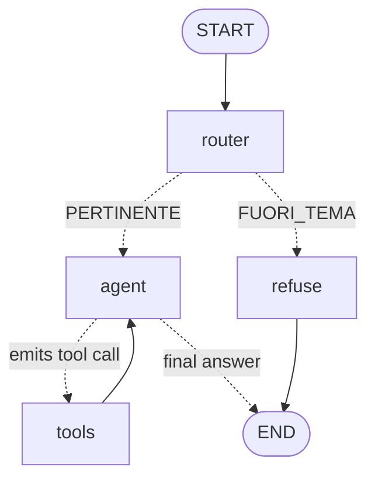

# Study Agent

A RAG agent that answers questions about the material of a university course on Artificial
Intelligence, citing the source file and page. Built with LangGraph, Qdrant and a local LLM
served by Ollama, behind a FastAPI server with Google login.

It is not a "chat with your PDF": the agent decides on its own which tools to use, can chain
several searches, saves study notes to disk, and turns down off-topic questions before wasting a
generation on them. Every user only ever sees their own documents.

> The course, the prompts and the UI are in Italian, and so is the eval set. That turned out to
> matter, because part of the material is in English (see [Retrieval quality](#retrieval-quality)).

---

## Architecture


```mermaid
graph TD
    S([START]) --> router
    router -.->|PERTINENTE| agent
    router -.->|FUORI_TEMA| refuse
    agent -.->|emits tool call| tools
    agent -.->|final answer| E([END])
    tools --> agent
    refuse --> E
```

| Node | Role |
|---|---|
| `router` | Classifies the question as relevant or off-topic. Cuts it short before the agent. |
| `agent` | LLM with the tools bound. Decides whether to search or to answer. |
| `tools` | Runs the chosen tool (`ToolNode`), then goes back to the agent. |
| `refuse` | Canned refusal, without calling the LLM. |

The `agent ⇄ tools` loop is the ReAct pattern: the agent can run several searches in a row
before answering.

In front of the graph, `src/server.py` (FastAPI) handles the Google login and mounts the Gradio
chat on `/chat`. Without a session, Gradio answers 401. The logged-in user's `owner_id` reaches
the tools through the server-side session, never through the model (see Phases 1 and 2 in the
[roadmap](#roadmap)).

### Modules

| File | Responsibility |
|---|---|
| `src/config.py` | All configuration in one place. Service URLs and secrets come from the environment. |
| `src/ingestion.py` | PDF → chunks → embeddings → Qdrant, for one owner. Run once per set of PDFs. |
| `src/retrieval.py` | Connects to the existing collection and builds a retriever filtered by owner. |
| `src/tools.py` | The three tools available to the agent, built per request for one owner. |
| `src/agents.py` | The LangGraph graph. Also a standalone CLI. |
| `src/tenancy.py` | `owner_id` validation, and resolution of the current user from the request. |
| `src/app.py` | Gradio chat UI. Run on its own, it's the dev mode with local users. |
| `src/server.py` | FastAPI: Google OIDC login, session cookie, Gradio mounted on `/chat`. |
| `src/users.py` | Maps external identities `(iss, sub)` to internal `owner_id`s on PostgreSQL. Also a CLI to link accounts. |
| `eval/run_eval.py` | Measures retrieval on the eval set (`eval/dataset.json`). |
| `tests/` | pytest suite. Needs neither Qdrant nor Ollama; the identity tests use PostgreSQL. |

### Available tools

- **`search_course_material(query)`**: semantic search over the owner's material. Returns
  excerpts with file and page number.
- **`list_course_documents()`**: lists the owner's PDFs.
- **`save_study_note(title, content)`**: writes a markdown note to `notes/<owner_id>/`. It's the
  only tool with side effects.

---

## Requirements

- Python ≥ 3.11
- [Docker](https://docs.docker.com/get-docker/) (for Qdrant and PostgreSQL)
- [Ollama](https://ollama.com/) with the `qwen2.5:7b` model
- [uv](https://docs.astral.sh/uv/) (recommended) or pip
- For the Google login only: an OAuth client from
  [Google Cloud Console](https://console.cloud.google.com/apis/credentials)

## Getting started

```bash
# 1. Dependencies
uv sync

# 2. Configuration: copy the template and fill it in (every variable is explained in it)
cp .env.example .env

# 3. Qdrant and PostgreSQL
docker compose up -d

# 4. LLM
ollama pull qwen2.5:7b

# 5. Material: put your PDFs in data/
#    (PDFs are gitignored: they're course material and can't be redistributed)

# 6. Indexing, once per owner and whenever the PDFs change
uv run python -m src.ingestion --owner alice
```

Then pick one of the two ways to run the web app.

**Dev mode: local users, no Google.** Users come from `APP_USERS` (`alice:change-me`). The
username *is* the `owner_id`, so it has to match the `--owner` used for indexing.

```bash
uv run python -m src.app                             # http://localhost:7860
```

**Google login: the real setup.** In Google Cloud Console, create an OAuth client of type *Web
application* with `http://localhost:8000/auth/callback` as an authorized redirect URI, then fill
in `GOOGLE_CLIENT_ID`, `GOOGLE_CLIENT_SECRET`, `SESSION_SECRET` and `ALLOWED_EMAILS` in `.env`.

```bash
uv run python -m uvicorn src.server:app --port 8000  # http://localhost:8000
```

Open it as `localhost`, not `127.0.0.1`: Google requires the redirect URI to match exactly.

The first login creates a new, empty `owner_id` for your Google account (`u_` followed by random
hex). To see the documents already indexed under an owner, link your account to it, then log out
(`/logout`) and back in:

```bash
uv run python -m src.users link --email you@gmail.com --owner alice
```

Other entry points:

```bash
uv run python -m src.agents --owner alice      # terminal chat
uv run python -m eval.run_eval --owner alice   # retrieval eval: needs Qdrant, not Ollama
uv run pytest                                  # tests: need neither Qdrant nor Ollama
uv run ruff check . && uv run ruff format --check .
```

The identity tests run against PostgreSQL, on a separate `study_agent_test` database created on
the fly. If PostgreSQL isn't running, they're skipped with a message saying so.

---

## Retrieval quality

Measured on `eval/dataset.json`: 30 questions over the 4 course PDFs, each with the expected
file and pages checked against the PDF. The questions are written the way a student would ask
them, not copied from the slide titles, and some are hard on purpose: synonyms the course doesn't
use ("visita in larghezza", "DFS"), acronyms, and Italian questions about `12_ML.pdf`, which is
in English.

The eval calls the retriever directly, with no LLM: it's deterministic, runs in a few seconds,
and doesn't move when the generative model changes.

- **hit-rate@k**: fraction of questions with at least one correct chunk in the top k.
- **MRR@k**: mean of `1/rank` of the first correct chunk (0 if missing). Rewards the right
  chunk being *at the top*.

| k | `all-MiniLM-L6-v2` hit-rate | MRR | `paraphrase-multilingual-MiniLM-L12-v2` hit-rate | MRR |
|---:|---:|---:|---:|---:|
| 1 | 0.20 | 0.20 | **0.37** | **0.37** |
| 3 | 0.33 | 0.27 | **0.57** | **0.46** |
| 5 | 0.43 | 0.29 | **0.70** | **0.49** |
| 10 | 0.60 | 0.31 | **0.73** | **0.49** |

In production `RETRIEVER_K = 3`, so k=3 is the row that matters. Hit@3 per PDF:

| PDF | Questions | MiniLM-L6 | multilingual |
|---|---:|---:|---:|
| `12_ML.pdf` (English) | 6 | 0 | 5 |
| `2_Agenti_Intelligenti.pdf` | 7 | 5 | 6 |
| `10_Prolog.pdf` | 7 | 4 | 4 |
| `3_RcercaNonInformata.pdf` | 10 | 1 | 2 |

**How to read them:**

- **Almost all of the gain comes from the English PDF** (from 0/6 to 5/6). `all-MiniLM-L6-v2`
  is trained on English and doesn't connect an Italian question to an English slide; the
  multilingual model does.
- **Uninformed search stays at 2/10 with both models**, so it isn't a language problem. The
  slides of that PDF all share the same vocabulary ("ricerca", "nodo", "costo", "frontiera") and
  the wrong slide of the same PDF often wins. The best-first case gets worse: from rank 8 to
  outside the top 10.
- **The new model truncates its input at 128 tokens**, against 256 for the old one: 57 chunks out
  of 204 are only partly embedded, and the end of the slide is ignored. Some of the regressions
  (Prolog: recursive rule, unification, backtracking) may come from this. Next experiment:
  smaller chunks.

---

## Design choices

**800-character chunks, 100 overlap.** University slides have short, very dense paragraphs.
Bigger chunks diluted the signal in the embedding; smaller ones cut definitions in half.

**`paraphrase-multilingual-MiniLM-L12-v2` for embeddings.** It runs locally, it's free, it has
384 dimensions, and unlike `all-MiniLM-L6-v2` (the initial model) it handles Italian, including
Italian questions on English material: hit@3 goes from 0.33 to 0.57 on the eval set (see
[Retrieval quality](#retrieval-quality)). The important point: the embedding model and the
generative model are *independent* choices. Changing the generative model costs one line;
changing the embedding model forces re-indexing the whole corpus and invalidates every quality
measurement made before.

**Qdrant instead of FAISS.** Multi-tenancy needs filtering on the payload (see Phase 1): FAISS
doesn't have it, and migrating later would have cost more than picking it up front.

**A router node instead of a stricter system prompt.** A prompt is a statistical suggestion, not
a constraint: a 7B model ignores it. Before the router, asked "what's the carbonara recipe?", the
agent answered with the recipe without calling any tool. Now the graph closes that path
structurally.

**Routing fails open.** The refusal triggers only on an explicit `FUORI_TEMA` match; any other
output goes to the agent. Turning down a legitimate question does more harm than letting an
off-topic one through, which won't find anything in the material anyway.

**Authentication fails closed.** The opposite choice, on purpose. An empty `ALLOWED_EMAILS` lets
nobody in, a request without a session gets a 401, and an invalid `owner_id` raises an error
instead of falling back to a default. Letting the wrong person in can't be undone; asking the
right person to log in again costs a click.

---

## Known limitations

Things that don't work, or only half work. In order of severity.

1. **Retrieval misses 4 questions out of 10.** Hit@3 = 0.57 on the eval set (see
   [Retrieval quality](#retrieval-quality)): in almost half of the cases the agent doesn't get
   the right slide and answers with what it has. The worst case is `3_RcercaNonInformata.pdf`
   (2/10), including the known case: asked about "best-first", the agent replies that the
   material doesn't describe it, while the content is there (pp. 9-10).

2. **Conversation state lives in RAM.** `MemorySaver` doesn't persist: restart the process and
   the history is gone. The session name in the UI survives page refreshes, not server restarts.

3. **New users start empty.** Indexing is a CLI command run by whoever operates the server: a new
   Google account gets an `owner_id` with no documents, until someone indexes PDFs for it or
   links it to an existing owner. Upload from the UI comes with Phase 5.

4. **`save_study_note` loses the citations.** Chat answers cite file and page correctly, but
   the text that ends up in the saved note often doesn't.

5. **Notes can't be read back from the web UI.** They're written to `notes/<owner_id>/` on the
   server's disk. Fine for the CLI, but a web user has no way to open them.

6. **The router costs one LLM call per turn**, even just to refuse. On a local 7B you can feel
   it. A gate based on embedding similarity would do the same job in milliseconds.

7. **Routing relies on a substring match.** If the prompt changes and the model starts answering
   `OFF_TOPIC`, the router stops refusing, *silently*.

---

## Roadmap

The project is being extended into a multi-user service. The goal is learning: each phase exists
to understand a technology, not because the load requires it.

### Phase 0 — Foundations *(done)*

- [x] `pyproject.toml` + `uv.lock`
- [x] `docker-compose.yml` for the backing services
- [x] README
- [x] Eval set: 30 questions with the expected page, hit-rate@k and MRR@k metrics
- [x] Tests (routing, chunking, tool contract) with a fake LLM
- [x] Centralized `config.py`
- [x] `ruff` for linting and formatting

The eval set comes before everything else because it's the instrument every later choice is
measured with. Without it, comparing two models is a matter of opinion.

### Phase 1 — Multi-tenancy in the code *(done)*

No new infrastructure.

- [x] `owner_id` in the document metadata at ingestion time (`--owner`)
- [x] Payload index on `metadata.owner_id` with `is_tenant=True`, which partitions storage by
  tenant. **Not** one collection per user: Qdrant advises against it, since every collection
  has its own segments and indexes and the overhead explodes with the number of users
- [x] Lazy retriever (`@lru_cache`) instead of the global built at import time
- [x] Tools built **per request**, with `owner_id` captured by a closure
- [x] `owner_id` validated (`^[a-z0-9_-]{1,64}$`) wherever it comes in: it ends up in Qdrant
  filters and in file paths (`notes/<owner_id>/`)
- [x] Isolation tests on an in-memory Qdrant: search, file listing and re-indexing never cross
  owners

> **Security rule.** `owner_id` must never be a tool parameter. Tool arguments are filled in by
> the LLM: putting it in the signature would hand access control to anyone who can type
> *"search the documents of owner_id=another_user"*. It has to come from the server-side session
> and not be expressible by the model. A test checks that no tool exposes it.

### Phase 2 — Authentication: FastAPI + Google OIDC *(done)*

Gradio has nowhere to put authentication. FastAPI goes underneath, with Gradio mounted on top at
`/chat` through `gr.mount_gradio_app`: on every request Gradio asks FastAPI who the user is
(`auth_dependency`), and without a session it answers 401.

- [x] **Google as the OIDC provider**, through Authlib: authorization code flow with PKCE
- [x] ID token validated by Authlib against Google's JWKS: signature, `iss`, `aud`, `exp`, `nonce`
- [x] Allowlist (`ALLOWED_EMAILS`), verified emails only. Empty list = nobody gets in
- [x] External identity mapped to an internal `owner_id` on **PostgreSQL**
- [x] Signed session cookie that carries the `owner_id`, never the Google tokens. `Secure` by
  default
- [x] `thread_id = f"{owner_id}:{session}"`: one user's "sessione-1" isn't another user's
- [x] Tests with a fake provider: unverified email, email not in the allowlist, empty allowlist,
  provider error, login, logout

**Google instead of Keycloak.** The original plan was a self-hosted Keycloak, to see the protocol
from the inside. A hosted provider means one less service to run and secure, and the protocol is
the same: since it's standard OIDC, moving to Keycloak, Cognito or Entra ID is mostly
configuration (issuer URL, client ID and secret).

**Why not use `sub` directly as the `owner_id`.** `sub` is unique only within its issuer: two
providers can hand out the same `sub` to two different people, so the key is the `(iss, sub)`
pair. The indirection also makes accounts portable: linking a second login, or moving to another
provider, is an `UPDATE` on one table instead of rewriting the `owner_id` of every chunk in
Qdrant. The `owner_id` is random (`u_` + 16 hex characters) and never comes from the client.

**Why PostgreSQL rather than SQLite.** SQLite is a file on one machine's disk: with two replicas
of the server, each would have its own identity table, and the same person would get a different
`owner_id` depending on which replica handled the login. PostgreSQL is a shared service, and it's
also where the LangGraph checkpointer will live in Phase 4.

> OAuth2 alone isn't enough: it's an *authorization* protocol, and answers "can this client
> access this resource?". What's needed is OIDC, the *authentication* layer built on top of
> OAuth2, which answers "who is this user?".

### Next up — CI with GitHub Actions

The tests already run without Qdrant or Ollama, so CI is cheap to add and comes next:

- On every push and pull request: `uv sync --locked`, `ruff check`, `ruff format --check`,
  `pytest`
- A PostgreSQL service container, so the identity tests run instead of being skipped
- uv cache between runs: the heavy part of the install is PyTorch, pulled in by
  `sentence-transformers`
- Status badge at the top of this README

### Phase 3 — Observability

Deliberately **before** the cache: without a baseline there's no way to prove that the
optimization worked.

- **Langfuse** (self-hosted) for the LLM layer: one trace per request with one span per graph
  node, plus tokens and cost per call. It's what answers "where is it slow": router, embedding,
  Qdrant search or generation?
- **Prometheus + Grafana** for the service layer: HTTP latency by percentile, throughput, error
  rate, cache hit rate
- OpenTelemetry instrumentation on the graph nodes

The two layers answer different questions. Grafana says *that* the p95 is 8 seconds; the trace
says that 6 of those 8 are the router call.

### Phase 4 — Redis: semantic cache and cost control

- **Two-level cache.** First level: hash of the normalized question, exact match, instant. Second
  level: embedding of the question and vector search among the questions already seen (Redis
  Stack has native HNSW); above a threshold, the cached answer is returned. In a course setting,
  where thirty students ask the same things in exam week, the savings are substantial
- **Rate limit per `owner_id`** (token bucket) and a monthly budget per user
- **Postgres checkpointer** (`langgraph-checkpoint-postgres`) instead of `MemorySaver`, on the
  PostgreSQL instance that's already there since Phase 2

> **The cache has to be partitioned by tenant.** With per-user documents, a global cache keyed on
> the question would leak user A's answer to user B asking the same question. The key must
> include the `owner_id`.

> The Postgres checkpointer isn't polish: with several replicas, `MemorySaver` keeps the
> conversation in the RAM of *one* process, and the next turn can land on another process that
> knows nothing about it. Sessions break intermittently. It's the prerequisite for scaling
> horizontally.

### Phase 5 — Asynchronous ingestion: Celery

Uploading a PDF can't block an HTTP request: chunking and embedding a long document take minutes.

- **Upload from the UI**, so that users can add their own material without the CLI
- **Celery with Redis as the broker.** Chosen because ingestion is a *job queue* (run this job
  once, with retries and status), not an event stream. And by this phase Redis is already there:
  zero extra infrastructure
- SQS would be the alternative if the goal were specifically practice with AWS

### Phase 6 — Kafka for usage events

Kafka is **not** on the chat path: a conversation is synchronous request/response, there would be
nothing to decouple and it would only add latency.

Where the shape really is event-driven: every LLM call emits
`{tenant, model, tokens, cost, latency}` to a topic, and independent consumers aggregate costs
per tenant, feed the budgets of Phase 4 and fill the dashboards of Phase 3. Append-only log,
multiple consumers, replay: the use case Kafka exists for.

### Phase 7 — Amazon Bedrock

- `ChatBedrockConverse` from `langchain-aws` instead of `ChatOllama`
- Credentials through IRSA, not static keys
- **The experiment:** the eval questions answered end to end by both models, compared on quality,
  latency and cost per question. It's the most interesting content this repo will produce
- The embedding model stays the same: changing it would force re-indexing everything

---

## License

The code is released under the [MIT License](LICENSE). The course PDFs aren't part of the
repository and aren't covered by it.
